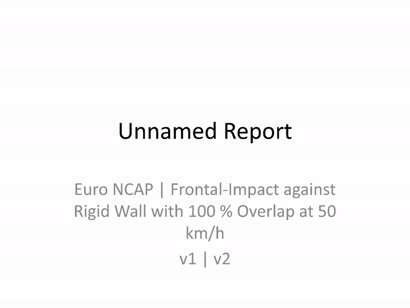

# pyisomme

[](https://github.com/jonaskeller14/pyisomme/actions/workflows/ci.yml)
[](https://app.codecov.io/gh/jonaskeller14/pyisomme)
[](https://pypi.org/project/pyisomme/)
[](https://pypi.org/project/pyisomme/)
[](https://github.com/jonaskeller14/pyisomme/blob/master/LICENSE)

## Installation

```
pip install pyisomme
```

PDF report export is optional. Install the PDF extra and its Chromium browser
binary once after installing or updating pyisomme:

```bash
pip install "pyisomme[pdf]"
python -m playwright install chromium
```

## Features
- Read/write ISO-MME (compressed/uncompressed)
- Modify Channel and calculate Injury Risk Values (HIC, a3ms, DAMAGE, OLC, BrIC, NIJ, ...)
- Calculate dummy head trajectories from head centre-of-gravity acceleration and rotational-velocity measurements
- Plot Curves and compare multiple ISO-MMEs
- Create PowerPoint, HTML, and PDF reports:
  - Curve Correlation
  - Euro NCAP: Frontal 50 km/h, Frontal MPDB, Side Barrier, Side Pole, and Side FarSide
  - FMVSS: 208 and 214
  - IIHS: Frontal Small Overlap, Frontal Moderate Overlap, and Side Impact
  - UN: Frontal 50 km/h R137, Frontal 56 km/h ODB R94, Side Pole R135, and Side Barrier R95
- Display Limit bars in plots
- Compare performance of left-hand-drive vehicle with right-hand-drive vehicle
- Command-line tools for listing, merging, editing, converting, plotting, and reporting ISO-MME data

## Command Line Interface (CLI)

Installing the package provides the `pyisomme` command. The equivalent
`python -m pyisomme` form is also supported.

```bash
pyisomme --help
pyisomme <command> --help
```

| Command | Purpose |
| --- | --- |
| `list` | List channels, optionally selected by code patterns |
| `code` | Decode a 16-character channel code and show its default unit |
| `merge` | Merge and transform one or more ISO-MME containers |
| `set` | Set one or more metadata fields on selected channels in place |
| `convert` | Numerically convert selected channel data to another unit in place |
| `plot` | Plot selected or calculated channels |
| `report` | Calculate and export an assessment report |


Describe a channel code:

```bash
pyisomme code 11HEADCG00H3ACXD
```

```text
Code: 11HEADCG00H3ACXD
Test Object: Vehicle 1
Position: Front left
Main Location: Head
Fine Location 1: Center of Gravity
Fine Location 2: Not defined
Fine Location 3: Hybrid III Mid-Sized Adult Male Dummy
Physical Dimension: Acceleration
Direction: Longitudinal
Filter Class: CFC 60
Default unit: m / s2
```

Edit channel codes

```bash
pyisomme set TEST1.mme TEST2.zip --fine-location-3 H3 -c '11HEAD000000ACXP' '13CHST000000DSXP'
```

Convert channel values and units (e.g. `0.04 m` becomes `40 mm`)

```bash
pyisomme convert TEST1.mme TEST2.zip --unit mm -c '13CHST0000H3DSXP'
```

Merge multiple ISO-MME containers:

```bash
pyisomme merge ./iso_merged.zip ./iso_1/v1.mme ./iso_2.zip ./iso_3.tar.gz
```

Resample from 0 to 100 ms with a 1 ms step and linear interpolation:

```bash
pyisomme merge ./resampled.mme ./iso_1/v1.mme --resample 0 0.001 0.1
```

Plot a calculated resultant head acceleration with filter class A / 1000 Hz:

```bash
pyisomme plot ./iso_1/v1.mme --codes '24HEAD??????ACRA' --xlim 0 100 --calculate
```

Create HTML, PDF, and PowerPoint reports in one run using only data from 0 to
200 ms. Repeat `-o`/`--output` for every desired format; the format is inferred
from the output file extension.

```bash
pyisomme report EuroNCAP_Frontal_MPDB data/nhtsa/09203 --crop 0 0.2 \
  -o out/report.html \
  -o out/report.pdf \
  -o out/report.pptx
```

## Python Examples
- [Read ISO-MME](docs/isomme_read.ipynb)
- [Write ISO-MME](docs/isomme_write.ipynb)


- [Signal deriviation/integration](docs/channel_diff_int.ipynb)
- [Add/Subtract/Multiply/Divide Signals](docs/channel_operators.ipynb)
- [Apply cfc-filter](docs/channel_filter.ipynb)


- [Plotting](docs/plotting.ipynb)

- [Report](docs/report.ipynb)

## Example Report

Animated preview of a Euro NCAP PowerPoint report generated with pyisomme (using synthetic data):

<p align="center">
  
</p>

## Limitations
- Only test-info (.mme), channel-info (.chn) and channel data files (.001/.002/...) are supported. All other files (videos, photos, txt-files) will be ignored when reading and writing.
- Writing methods do not ask before overwriting. In particular, `set` and `convert` rewrite every
  supplied ISO-MME container in place after validating all inputs and selections.
